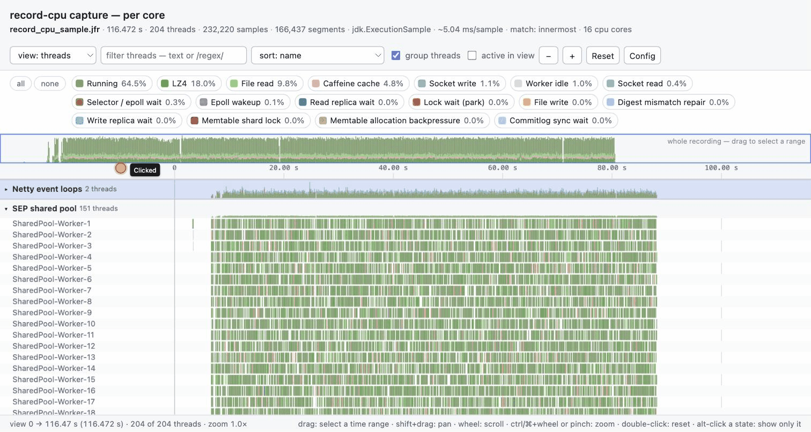

# jfr-thread-timeline

Turns an [async-profiler](https://github.com/async-profiler/async-profiler) (or plain JDK) JFR
recording into a single self-contained HTML page showing **what every thread was doing over time**.



*A two-minute capture of a Cassandra node: 204 threads in collapsible groups, coloured by what they
were doing, drag anywhere to select a time range. Then the per-core view — 16 cores, hover for the
thread, drop a whole group from the legend, and zoom in until the individual handovers are visible.
Click a slice for the stack behind it.*

A thread's state at any instant is decided by the frames on its stack at that instant. You describe
the states you care about in a YAML file — a name, a colour and a list of frame patterns — and each
sample is painted with the colour of the matching state.

```
                 0s        10s       20s       30s       40s
main            ████████░░░░▓▓▓▓▓▓▓▓████░░░░░░░░████████████
MutationStage-1 ░░████████████░░░░████████▓▓▓▓░░████░░░░████
CompactionExec  ████████████████████████████████████████████
GC Thread#0     ░░░░░░░░████░░░░░░░░░░░░████░░░░░░░░░░░░████

█ Running   ░ Lock wait (park)   ▓ Socket read   ...
```

The page is interactive: zoom and pan the time axis, hover any segment for the stack that produced
it, click to pin the full stack, filter and re-sort threads, and toggle states on and off.

## Build

```bash
mvn package
```

Produces `target/jfr-thread-timeline.jar` (a single fat jar; needs Java 11+).

## Use

```bash
# simplest form - uses the built-in state config, writes profile-timeline.html next to the input
java -jar target/jfr-thread-timeline.jar profile.jfr

# your own states, explicit output, open it straight away
java -jar target/jfr-thread-timeline.jar -c states.yaml -o report.html --open profile.jfr

# zoom in on one second of one thread pool
java -jar target/jfr-thread-timeline.jar --from 12000 --to 13000 --threads 'worker-*' profile.jfr
```

### Recording the input

The timeline is only as good as the samples behind it. **Wall-clock profiling is what you want** —
it samples every thread whether or not it is on CPU, so blocked threads show up:

```bash
# while the JVM runs
asprof -e wall -i 10ms -d 60 -f profile.jfr <pid>

# or at JVM start
-agentpath:/path/to/libasyncProfiler.so=start,event=wall,interval=10ms,file=profile.jfr
```

A CPU profile (`-e cpu`, or the JDK's own `jdk.ExecutionSample`) also works, but a thread is only
sampled while it is running, so idle and blocked stretches appear as blank gaps rather than as
coloured states.

When a recording contains both, `profiler.WallClockSample` wins automatically. Override with
`--event-type` or the `eventTypes` key in the config.

### Options

```
  -c, --config <file>     YAML file mapping frames to coloured states (default: built-in)
  -o, --output <file>     HTML to write (default: <recording>-timeline.html)
  -t, --title <text>      title shown in the page header
      --threads <pattern> only threads whose name matches (substring, glob or re:...)
      --max-threads <n>   keep only the n threads with the most samples
      --from <ms>         start of the time window, ms from the recording start
      --to <ms>           end of the time window
      --event-type <name> event type to build the timeline from (repeatable)
      --stack-depth <n>   frames kept per stack for the tooltip (default 64)
      --compress <mode>   auto (default) | always | never - gzip the embedded data
      --list-events       print the event types in the recording and exit
      --top-unmatched <n> list the hottest frames that matched no state
      --dump-config       print the built-in configuration and exit
      --open              open the generated HTML in the default browser
  -v, --verbose           more logging      -q, --quiet   less
```

## Configuration

Start from the built-in config and edit it:

```bash
java -jar target/jfr-thread-timeline.jar --dump-config > states.yaml
```

```yaml
matchStrategy: innermost      # or: config-order
maxStackDepth: 64

fallback:
  useThreadState: true        # colour unmatched samples by the JFR thread state
  name: Other
  color: "#c4c4c4"

threads:
  exclude: ["C1 CompilerThre*", "C2 CompilerThre*"]

states:
  - name: Socket read
    color: "#4e79a7"
    description: Blocked reading from a socket
    frames:
      - sun.nio.ch.SocketDispatcher.read0
      - java.net.SocketInputStream.socketRead0
      - "re:^lib.*\\.(__)?(libc_)?recv(from|msg)?$"

  - name: Lock wait (park)
    color: "#e15759"
    frames:
      - java.util.concurrent.locks.LockSupport.park
      - jdk.internal.misc.Unsafe.park
```

### The CPU core view

If the recording was taken with async-profiler's `--record-cpu` (4.3+, perf-events engine on
Linux), the `view:` dropdown offers a second layout: **one row per CPU core**, showing which
thread occupied it over time.

```bash
asprof -e cpu --record-cpu -d 60 -f profile.jfr <pid>
```

```
        0s        2s        4s        6s        8s
cpu 0   ████▓▓▓▓░░░░████████▓▓▓▓░░░░████████████
cpu 1   ▓▓▓▓████░░░░░░░░████▓▓▓▓████░░░░████████
cpu 2   ░░░░████████▓▓▓▓████░░░░████████▓▓▓▓████
cpu 3   ████░░░░▓▓▓▓████████████░░░░████▓▓▓▓░░░░

█ SEP shared pool   ▓ Netty event loops   ░ GC
```

Colour a slice by **thread group** (default), by **thread**, or by **state**; the legend follows
and shows each one's share of CPU time. Hover for the thread, its group, the state and the stack;
click to pin it. The switcher only appears when the recording actually carries core ids.

`--record-cpu` does not add an event field — it encodes the core as a synthetic frame in the
stack, written into JFR as `CPU-7`. This tool looks for that frame anywhere in the stack rather
than at a fixed end, so it keeps working if async-profiler moves it.

Two things follow from how the data is sampled. A core row shows the thread that was **sampled**
on that core, so at a 10 ms interval you see a handover sequence, not every context switch. And
a core that ran nothing but other processes is simply absent — the profiler only sees its own
JVM's threads.

### Thread groups

Hundreds of threads is a wall of rows. `threadGroups:` buckets them by name into collapsible
groups, first match wins, file order preserved:

```yaml
ungroupedName: Application       # bucket for threads no group claimed

threadGroups:
  - name: GC
    threads: ["re:^(GC Thread|G1 |Shenandoah|Z Worker)", "VM Thread"]
  - name: Netty event loops
    threads: ["re:^(epoll|nio)EventLoopGroup"]
  - name: Compaction & flush
    threads: ["re:^(CompactionExecutor|MemtableFlushWriter)"]
```

Patterns use the same syntax as `frames`. The built-in config already groups the standard JVM
threads (GC, JIT compiler, event loops, JVM internals, JMX) so anything left is your application.

A **collapsed group draws a summary band** instead of its rows: for every pixel column, how the
group's threads split across states, with the bar height being the share of the pool that was
observed at all. An idle pool is a thin line; a pool where every thread is busy fills the row.
Thirty GC threads collapse to one row that still shows every GC burst.

| gesture | effect |
| --- | --- |
| click a group header | collapse / expand it |
| alt-click a group header | collapse or expand **all** groups |
| hover a group header | thread count, sample count and the group's state breakdown |
| `group threads` checkbox, or `G` | turn grouping off entirely |

The thread filter also matches group names, so typing `GC` narrows to the GC threads. Groups keep
their configured order; the sort dropdown orders threads *within* each group.

### Frame patterns

Patterns are matched against the frame string `pkg.Class.method`. Native frames from
async-profiler look like `libjvm.so.ObjectMonitor::enter` and match the same way.

| Pattern | Meaning |
| --- | --- |
| `java.net.Socket` | substring match (the forgiving default) |
| `=java.lang.Thread.sleep` | the frame must be exactly this |
| `sun.nio.ch.*.read0` | glob over the whole frame (`*` and `?`) |
| `re:^libjvm.*::enter$` | Java regex, unanchored unless you anchor it |

Set `ignoreCase: true` at the top level to make all of them case-insensitive.

### Which rule wins

`matchStrategy: innermost` (the default) walks the stack from the leaf downwards and takes the
**first frame** that matches any rule. A socket read inside a lock section is reported as a socket
read, because that is what the thread is actually doing:

```
sun.nio.ch.SocketDispatcher.read0        <- matches "Socket read"   => this one wins
sun.nio.ch.SocketChannelImpl.read
java.util.concurrent.locks.LockSupport.park   <- matches "Lock wait"  (ignored)
com.example.Handler.run
```

`matchStrategy: config-order` instead treats the rule list as a priority list: the first rule in
the file that matches **anywhere** in the stack wins, regardless of depth.

### Nested match sequences

Some states cannot be told apart by a single frame. A thread parked on a memtable shard lock and
a thread parked waiting for replica responses both bottom out in `LockSupport.park` — what
separates them is what called into it. `sequences:` matches a **list of frames that must appear
on the stack, innermost first**, with gaps allowed:

```yaml
states:
  - name: Memtable shard lock
    color: "#8c564b"
    sequences:
      - ["LockSupport.park", "TrieMemtable$MemtableShard.put"]

  - name: Replica response wait
    color: "#17becf"
    sequences:
      - ["LockSupport.park", "AbstractWriteResponseHandler.get"]

  - name: Lock wait (park)          # catch-all, must come last
    color: "#e15759"
    frames: ["LockSupport.park"]
```

```
 0  jdk.internal.misc.Unsafe.park
 1  java.util.concurrent.locks.LockSupport.park            <- step 1  ─┐ Memtable shard lock
 2  ...concurrent.WaitQueue$Standard$AbstractSignal.await               │
 3  ...memtable.TrieMemtable$MemtableShard.put             <- step 2  ─┘
 4  ...memtable.TrieMemtable.put
 5  ...db.Keyspace.applyInternal
```

Only the frames that carry meaning need naming — everything between the steps is ignored. Both
matched frames are highlighted in the tooltip and the pinned stack, so you can see why a segment
got its colour.

Each rule may carry any number of sequences (they are OR'd), and may mix `frames:` with
`sequences:`. A step may list alternatives, satisfied when any of them matches:

```yaml
    sequences:
      - [["Unsafe.park", "LockSupport.park"], "SEPWorker.doWaitSpin"]
```

A sequence's **position is the index of its innermost step** — that is what `innermost` compares.
So a sequence anchored on `park` still loses to a socket read at the leaf, which is what you want.

> **The one thing to get right.** A real park stack carries several park-ish frames stacked on
> top of each other. If your catch-all names `Unsafe.park` (frame 0) but your sequence starts at
> `LockSupport.park` (frame 1), the catch-all anchors nearer the leaf and wins **every time** —
> your specific state silently reports 0%. Give every rule competing for the same park the *same*
> set of innermost frames, then plain config order decides. A YAML anchor keeps that honest:
>
> ```yaml
> _park_frames: &park
>   - jdk.internal.misc.Unsafe.park
>   - java.util.concurrent.locks.LockSupport.park   # substring, so parkNanos matches too
>
> states:
>   - {name: Worker idle,      sequences: [[*park, "SEPWorker.doWaitSpin"]]}
>   - {name: Read replica wait, sequences: [[*park, "ReadCallback.awaitUntil"]]}
>   - {name: Lock wait (park), frames: *park}       # catch-all last
> ```
>
> You do not have to spot this yourself — the tool warns when a state matched samples but never
> won any of them, and names the rule that took them:
>
> ```
> WARNING: state 'Read replica wait' matched 74,231 samples but never won one -
>          'Lock wait (park)' took them all.
> ```

`config/cassandra.yaml` is a worked example. On a wall-clock recording of a
Cassandra node it turns one undifferentiated 80.5% "Lock wait (park)" band into:

| state | share |
| --- | --- |
| Worker idle | 54.9% |
| Read replica wait | 17.8% |
| Write replica wait | 7.1% |
| Lock wait (park) — everything else | 0.7% |

> **Careful with generic native frames.** With `innermost`, a rule matching
> `pthread_cond_wait` would win over a deeper `Unsafe.park`, painting every parked thread as a
> generic native wait. That is why the built-in config deliberately does not match the low-level
> pthread/futex primitives — the meaningful frame is usually a little deeper.

### Finding what to configure

```bash
java -jar target/jfr-thread-timeline.jar --top-unmatched 40 profile.jfr
```

prints the hottest leaf frames of samples that matched no rule at all — the shortlist of states
worth adding.

## Reading the page

| Gesture | Effect |
| --- | --- |
| wheel | scroll the thread list |
| ctrl/⌘ + wheel, or trackpad pinch | zoom the time axis at the cursor |
| drag across the rows | select a time range and zoom to it |
| shift + drag | pan |
| double-click | reset zoom |
| drag on the overview strip | jump to a time range |
| hover a segment | thread, state, time range and the stack, with the deciding frames highlighted |
| click a segment | pin the full stack in a side panel |
| click a legend chip | hide/show that state |
| alt/shift-click a chip | show **only** that state; again to bring the rest back |
| `all` / `none` | show or hide every state at once |
| click a group header | collapse / expand; alt-click for all groups |
| `view:` dropdown, or `V` | switch between thread rows and CPU cores (needs `--record-cpu`) |
| `Config` button | the configuration this report was rendered with, with a copy button |
| `W`/`S` `A`/`D` `0` `F` `N` `G` `V` `C` | zoom in/out, pan, reset, filter, hide all states, grouping, view, config |

### The report remembers its own configuration

Every generated page embeds the config file it was rendered with, reachable from the `Config`
button (or `C`). It is the verbatim file, preceded by comment lines recording the recording name,
the config name, the command line and the timestamp — so it stays valid YAML and can be copied
straight back into `--config` to reproduce or refine the run.

```yaml
# Configuration used to render this timeline.
# recording : profile.jfr
# config    : cassandra.yaml
# command   : jfr-thread-timeline -c cassandra.yaml -o out.html profile.jfr
# generated : 2026-08-13T11:26:25.385549Z
# events    : profiler.WallClockSample
...
```

File arguments are deliberately reduced to their bare name — the directories they sat in say more
about the machine that ran the tool than about the profile, and reports get shared.

## What ends up in a generated report

A report is a rendering of your profile, so it necessarily contains **thread names and stack
frames from the profiled process**. That is the point of the tool, but it is worth knowing before
you send one outside your organisation. In practice this can include more than you expect:

- thread names often carry peer addresses — a JMX client shows up as
  `RMI TCP Connection(42)-10.1.2.3`
- native frames can carry absolute paths, e.g. a temp-extracted
  `/opt/app/tmp/libnetty_transport_native_epoll_x86_64…so`
- the page records the recording's wall-clock start time

Nothing about the machine that *ran the tool* is included: paths are shortened to file names, and
there is no username, hostname or environment capture. If you need to share a report externally,
skim the thread list and use `--threads` to narrow it first.

## License

Apache License 2.0 — see [LICENSE](LICENSE).

Blank means *no sample* — either the thread did not exist yet, or it was not observed (a CPU
profile does not sample a blocked thread). Two samples further apart than the gap threshold
(≈2.5× the detected sampling interval, override with `gapThresholdMs`) are treated as "not
observed in between" rather than one long state.

## How it works

1. **Read** — `jdk.jfr.consumer.RecordingFile` walks the recording; frames and stacks are interned
   so a repeated stack costs one identity lookup.
2. **Classify** — every unique *frame* is tested against the rules once, then every unique *stack*
   once. Per-sample classification is a single array lookup.
3. **Segment** — each thread's samples are run-length encoded: consecutive samples in the same
   state become one segment, carrying its most representative stack for the tooltip.
4. **Render** — the model is serialised as delta-encoded JSON (gzipped and base64'd above 4 MB) and
   embedded in a template with inline CSS/JS. No network access, no CDN, no build step.

A 120 s / 409k-sample recording of 373 threads converts in about 5 s into a 2.4 MB page.

## Layout

```
src/main/java/com/github/netudima/jfr/thread/timeline/
  Main.java          CLI and orchestration
  Config.java        YAML config model and loader
  FrameMatcher.java  substring / exact / glob / regex frame patterns
  Recording.java     JFR reading, frame+stack interning
  Classifier.java    stack -> coloured state
  Timeline.java      samples -> run-length encoded segments
  CpuCores.java      --record-cpu frames -> one row per CPU core
  HtmlWriter.java    JSON serialisation and template expansion
src/main/resources/com/github/netudima/jfr/thread/timeline/
  default-config.yaml  built-in states
  timeline.html/.css/.js  the viewer
config/
  cassandra.yaml     ready-made states and thread groups for a Cassandra node
```
